# 🔄 Customer Churn Prediction — Ensemble Learning

> An ensemble machine learning approach for telecom customer churn prediction using **XGBoost**, **CatBoost**, and **Gradient Boosting** classifiers with **weight optimization** and **isotonic regression calibration**.

---

## 🏆 Results

Achieved a **Public Score of 0.91403** on Kaggle.

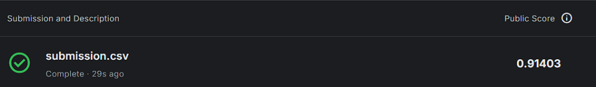

---

## 📋 Table of Contents

- [Overview](#overview)
- [Dataset](#dataset)
- [Exploratory Data Analysis](#exploratory-data-analysis)
- [Modeling Approach](#modeling-approach)
- [Results](#results)
- [Tech Stack](#tech-stack)
- [Project Structure](#project-structure)
- [Getting Started](#getting-started)

---

## 📖 Overview

Customer churn is one of the most critical challenges for telecom companies. This project builds a robust **ensemble model** that predicts whether a customer will leave ("churn") a telecom service, using a combination of three powerful gradient boosting algorithms.

**Key Highlights:**

- 🏗️ **Ensemble of 3 models** — XGBoost, CatBoost, and Gradient Boosting
- 🔁 **Stratified 5-Fold Cross-Validation** for robust out-of-fold predictions
- ⚖️ **Grid-search weight optimization** to find the best model blend
- 📐 **Isotonic Regression Calibration** for well-calibrated probability estimates
- ⚡ **GPU-accelerated training** (XGBoost on CUDA, CatBoost on GPU)

---

## 📊 Dataset

The dataset is a telecom customer dataset with **594,194 training samples** and **21 features** including:

| Feature            | Description                                          |
| ------------------ | ---------------------------------------------------- |
| `gender`           | Male / Female                                        |
| `SeniorCitizen`    | Whether the customer is a senior citizen (0/1)       |
| `Partner`          | Whether the customer has a partner                   |
| `Dependents`       | Whether the customer has dependents                  |
| `tenure`           | Number of months with the company                    |
| `PhoneService`     | Whether the customer has phone service               |
| `MultipleLines`    | Whether the customer has multiple lines              |
| `InternetService`  | Type of internet service (DSL / Fiber optic / No)    |
| `OnlineSecurity`   | Whether the customer has online security             |
| `OnlineBackup`     | Whether the customer has online backup               |
| `DeviceProtection` | Whether the customer has device protection           |
| `TechSupport`      | Whether the customer has tech support                |
| `StreamingTV`      | Whether the customer has streaming TV                |
| `StreamingMovies`  | Whether the customer has streaming movies            |
| `Contract`         | Contract term (Month-to-month / One year / Two year) |
| `PaperlessBilling` | Whether the customer has paperless billing           |
| `PaymentMethod`    | Payment method                                       |
| `MonthlyCharges`   | Monthly charge amount                                |
| `TotalCharges`     | Total charges                                        |
| **`Churn`**        | **Target — whether the customer churned (Yes/No)**   |

**Target Distribution:**

- No (stayed): **77.49%** (460,377)
- Yes (churned): **22.51%** (133,817)

> ⚠️ The dataset has a **significant class imbalance** (~77/23 split), which is handled through stratified splitting and careful model training.

---

## 🔍 Exploratory Data Analysis

### Outlier Detection — Boxplots

Boxplots were generated for numerical features to identify outliers and understand distributions.

<p align="center">
  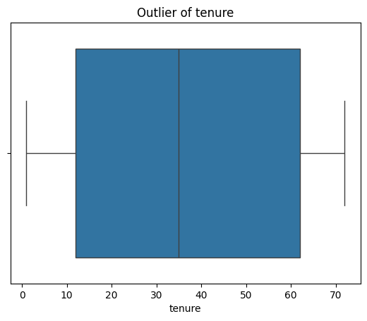
  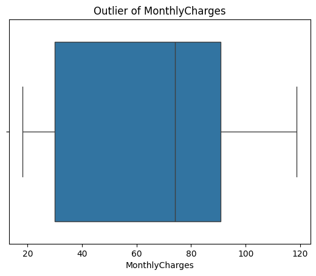
</p>
<p align="center">
  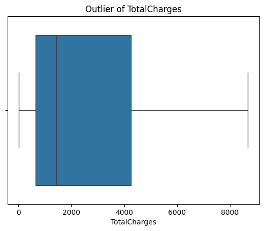
  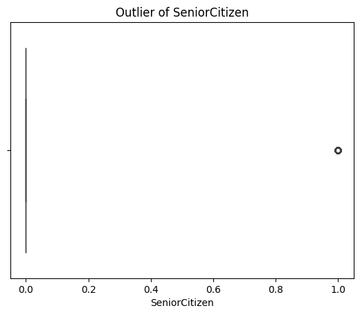
</p>

### Feature Relationships — Pairplot

A pairplot colored by Churn status reveals relationships between numerical features and helps identify separability patterns.

<p align="center">
  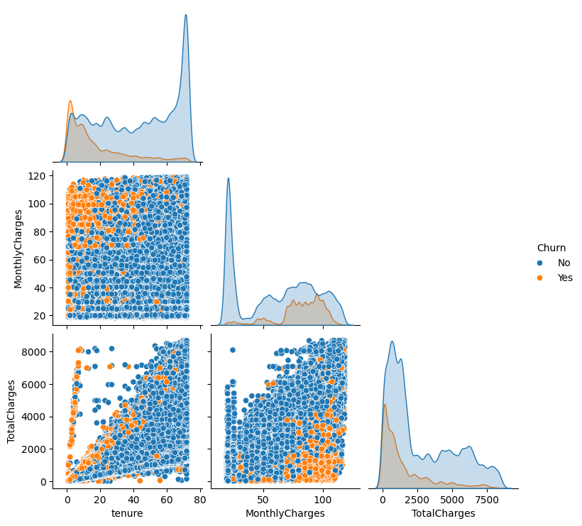
</p>

### Categorical Feature Analysis

Countplots for each categorical feature, split by Churn status, reveal key predictors:

<p align="center">
  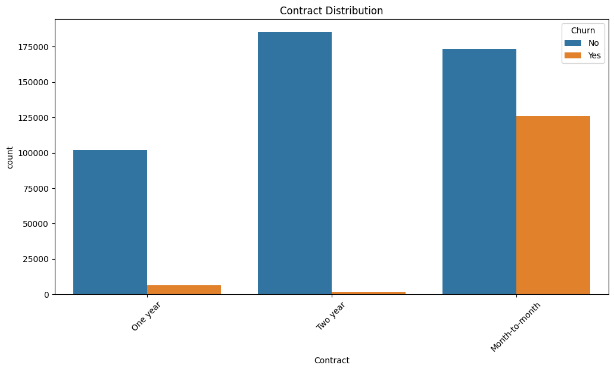
  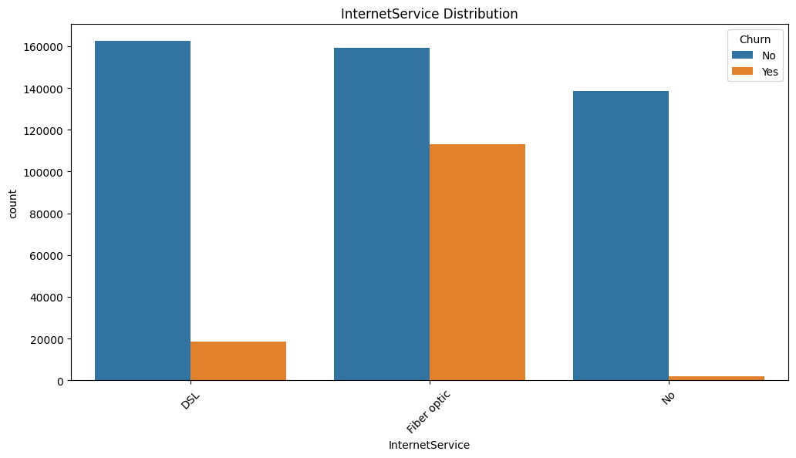
</p>
<p align="center">
  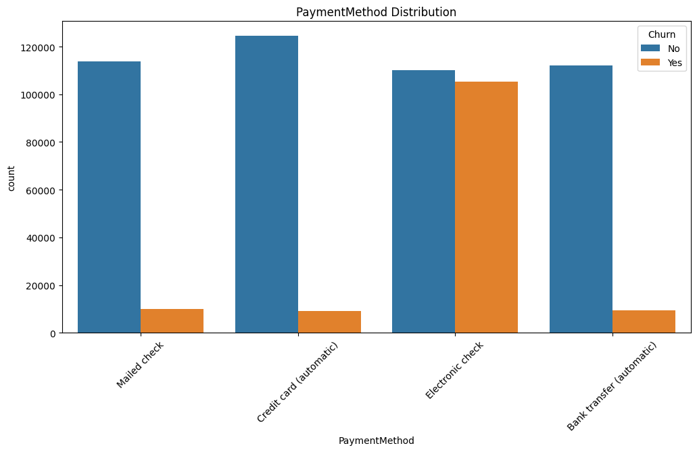
  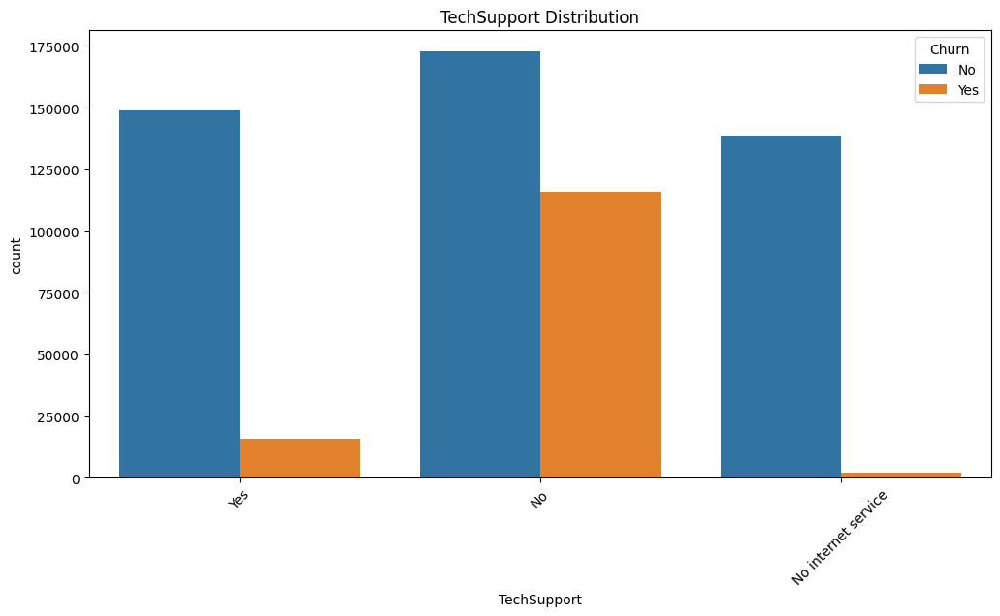
</p>
<p align="center">
  
  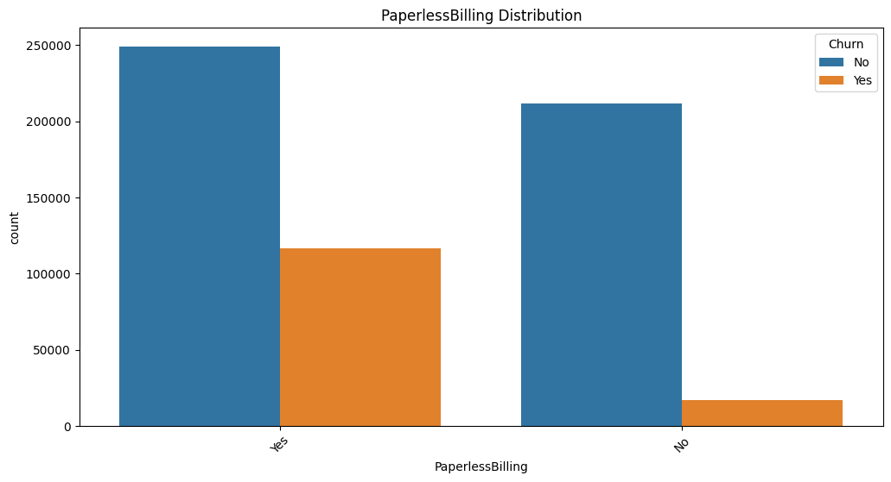
</p>
<p align="center">
  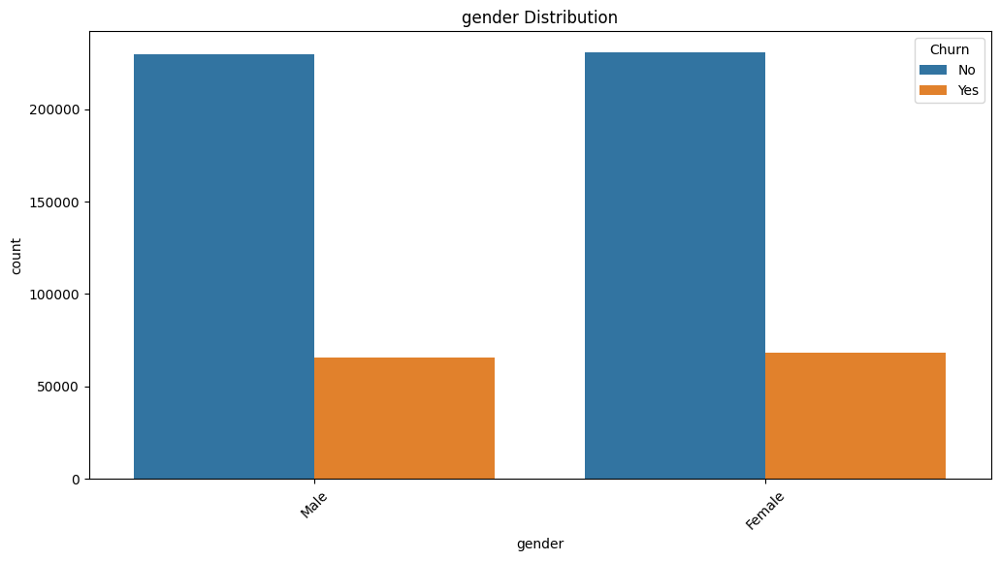
  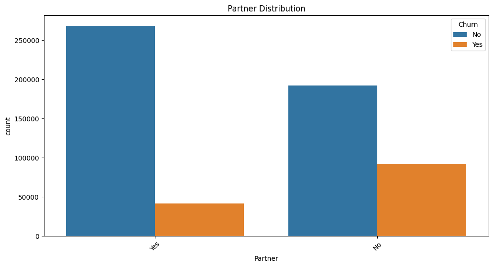
</p>
<p align="center">
  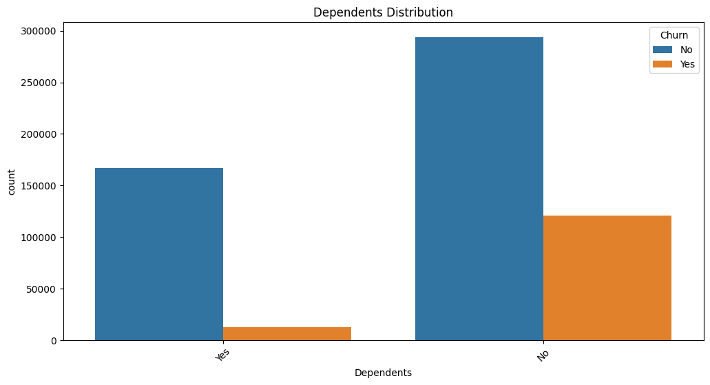
  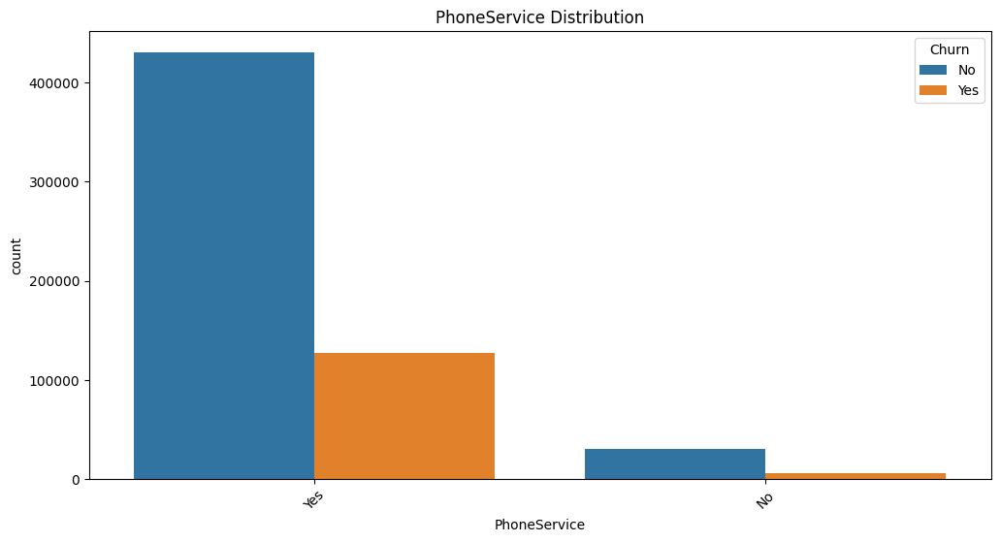
</p>
<p align="center">
  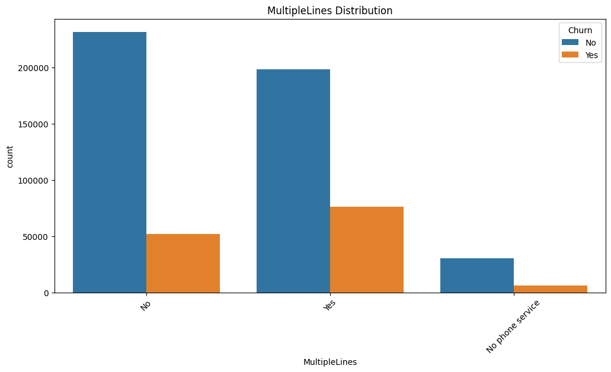
  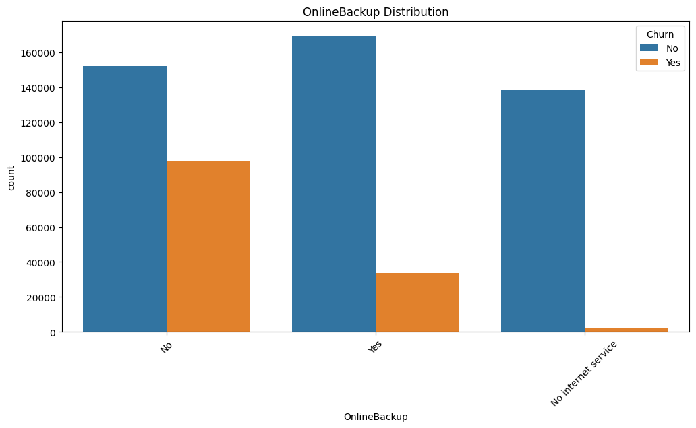
</p>
<p align="center">
  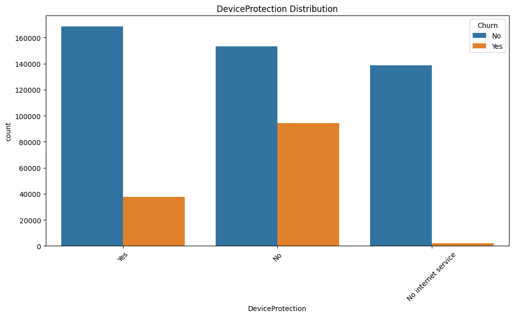
  
</p>
<p align="center">
  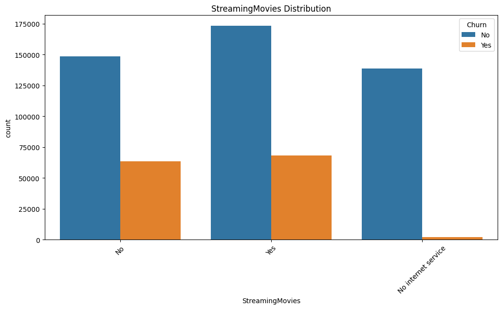
</p>

**Key Findings from EDA:**

- 📊 **Contract type** is one of the strongest predictors — month-to-month customers churn the most
- 🌐 **Fiber optic** internet users have the highest churn rate
- 💳 **Electronic check** payment method is associated with higher churn
- 🛡️ Customers **without security/support services** churn more frequently
- 👤 **Gender** has minimal impact on churn

---

## 🤖 Modeling Approach

### Pipeline Architecture

```
Raw Data
   │
   ├── Numerical Features ──→ StandardScaler
   │
   └── Categorical Features ──→ OneHotEncoder (drop='first')
         │
         ▼
   ┌─────────────────────────────────────────────┐
   │         Stratified 5-Fold CV                │
   │                                             │
   │  ┌──────────┐ ┌──────────┐ ┌────────────┐  │
   │  │ XGBoost  │ │ CatBoost │ │  Gradient  │  │
   │  │ (4000    │ │ (4000    │ │  Boosting  │  │
   │  │  trees,  │ │  iters,  │ │  (2000     │  │
   │  │  GPU)    │ │  GPU)    │ │   trees)   │  │
   │  └────┬─────┘ └────┬─────┘ └─────┬──────┘  │
   │       │             │             │         │
   │       ▼             ▼             ▼         │
   │    OOF Preds     OOF Preds    OOF Preds     │
   └─────────────────────────────────────────────┘
         │             │             │
         ▼             ▼             ▼
   ┌─────────────────────────────────────────────┐
   │     Grid Search Weight Optimization         │
   │     w_xgb + w_cat + w_gbc = 1.0             │
   └──────────────────┬──────────────────────────┘
                      ▼
   ┌─────────────────────────────────────────────┐
   │     Isotonic Regression Calibration         │
   └──────────────────┬──────────────────────────┘
                      ▼
              Final Predictions
```

### Model Hyperparameters

| Parameter        | XGBoost    | CatBoost | GradientBoosting |
| ---------------- | ---------- | -------- | ---------------- |
| Trees/Iterations | 4,000      | 4,000    | 2,000            |
| Max Depth        | 8          | 8        | 7                |
| Learning Rate    | 0.01       | 0.01     | 0.02             |
| Subsample        | 0.8        | 0.8      | 0.8              |
| Device           | GPU (CUDA) | GPU      | CPU              |

### Ensemble Strategy

1. **Out-of-Fold (OOF) Predictions** — Each sample gets predicted exactly once when it's in the validation set across 5 folds
2. **Weight Optimization** — Grid search over all valid weight triplets (step = 0.05) that sum to 1.0, maximizing AUC
3. **Isotonic Regression** — Calibrates the blended probabilities to produce well-calibrated confidence scores
4. **Test Averaging** — Final test predictions are averaged across all 5 folds for robustness

---

## 🛠️ Tech Stack

| Tool             | Purpose                                             |
| ---------------- | --------------------------------------------------- |
| **Python**       | Core programming language                           |
| **pandas**       | Data manipulation & analysis                        |
| **NumPy**        | Numerical computing                                 |
| **scikit-learn** | Preprocessing, pipelines, metrics, GradientBoosting |
| **XGBoost**      | Gradient boosting (GPU-accelerated)                 |
| **CatBoost**     | Gradient boosting with native categorical support   |
| **Matplotlib**   | Data visualization                                  |
| **Seaborn**      | Statistical data visualization                      |

---

## 📁 Project Structure

```
Churn/
├── data/
│   ├── train.csv               # Training data (594K samples)
│   ├── test.csv                # Test data for predictions
│   └── sample_submission.csv   # Submission format template
├── images/                     # EDA visualizations
│   ├── boxplot_*.png           # Outlier boxplots
│   ├── countplot_*.png         # Categorical feature distributions
│   ├── pairplot.png            # Feature pairplot
│   └── kaggle_score.png        # Kaggle submission score
├── churn-prediction-ensemble.ipynb  # Main notebook
├── breakdown.md                # Detailed notebook breakdown
├── submission.csv              # Final submission file
└── README.md                   # This file
```

---

## 🚀 Getting Started

### Prerequisites

```bash
pip install numpy pandas scikit-learn xgboost catboost matplotlib seaborn
```

### Run the Notebook

1. Clone the repository
2. Place the dataset files in the `data/` folder
3. Open `churn-prediction-ensemble.ipynb` in Jupyter Notebook
4. Run all cells

> **Note:** GPU acceleration requires CUDA-compatible hardware. Models will fall back to CPU if GPU is unavailable.

---

## 📝 License

This project is open source and available for learning purposes.
